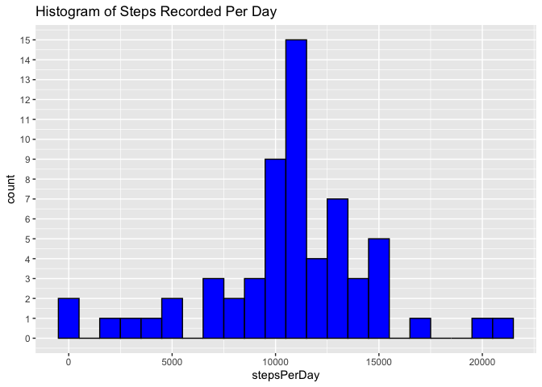

## Loading and preprocessing the data
And also displaying the head output

``` r
activity <- read.csv("./activity.csv")

head(activity)
```

```
##   steps       date interval
## 1    NA 2012-10-01        0
## 2    NA 2012-10-01        5
## 3    NA 2012-10-01       10
## 4    NA 2012-10-01       15
## 5    NA 2012-10-01       20
## 6    NA 2012-10-01       25
```

## What is mean total number of steps taken per day?

Using `aggregate()` (automatically sorts them ito the day category) 
and applying a sum function for each class

``` r
total_steps_per_day <- aggregate(activity$steps ~ activity$date, FUN = function(x) sum(x, na.rm = TRUE))
head(total_steps_per_day)
```

```
##   activity$date activity$steps
## 1    2012-10-02            126
## 2    2012-10-03          11352
## 3    2012-10-04          12116
## 4    2012-10-05          13294
## 5    2012-10-06          15420
## 6    2012-10-07          11015
```
constructing a histogram to display the results; using `ggplot2`
<!-- -->

calculating and reporting the mean and median steps for every day


``` r
summary(total_steps_per_day)
```

```
##      date            stepsPerDay   
##  Length:53          Min.   :   41  
##  Class :character   1st Qu.: 8841  
##  Mode  :character   Median :10765  
##                     Mean   :10766  
##                     3rd Qu.:13294  
##                     Max.   :21194
```
the mean number of steps is **10766** and the median number of steps
waled each day is **10765**


## What is the average daily activity pattern?

aggregating the data set according to the 5 min window

``` r
mean_steps_per_interval<- aggregate(activity$steps ~ activity$interval, FUN = function(x) mean(x, na.rm = TRUE))
head(mean_steps_per_interval)
```

```
##   activity$interval activity$steps
## 1                 0      1.7169811
## 2                 5      0.3396226
## 3                10      0.1320755
## 4                15      0.1509434
## 5                20      0.0754717
## 6                25      2.0943396
```

creating the plot


``` r
## change the names so they appear better in the graph and also 
names(mean_steps_per_interval) <- c("minuteOfDay", "meanSteps")

# construct the histogram in ggplot2
#define the data series
ggplot(mean_steps_per_interval, aes(x =minuteOfDay, y=meanSteps )) + 
    #edit the visuals: colors, title
    geom_line(color = "blue")+
    labs(title = "Mean of steps taken each interval over the days measured")
```

<!-- -->
Finding which interval contains the maxiumum number of steps

``` r
colMax <- function(x) sapply(x, max, na.rm = TRUE)

colMax(mean_steps_per_interval)
```

```
## minuteOfDay   meanSteps 
##   2355.0000    206.1698
```

the interval `2355` has the highest mean steps in every day examined

## Imputing missing values

finding total number of NA - lines with missing data

``` r
sum(is.na(activity))
```

```
## [1] 2304
```
there's **2304** rows with NA fields of data

The NA will be replaced with the median values for that interval 
in the days with data

``` r
#finding the median of the steps take in each interval
median_steps_per_interval<- aggregate(activity$steps ~ activity$interval, FUN = function(x) mean(x, na.rm = TRUE))

#replacing them 
data_filled <- activity

# Loop through each column and replace NAs with the median values
for (i in 1:nrow(data_filled)) {
  if (is.na(data_filled$steps[i])) {  # Check if 'steps' column has NA for the current row
    # Find the corresponding 'interval' value for this row
    interval_value <- data_filled$interval[i]

    # Find the median value for this 'interval' in the mean_steps_per_interval dataframe
    median_value <- median_steps_per_interval$`activity$steps`[
      median_steps_per_interval$`activity$interval` == interval_value
    ]
    # Replace the missing value with the median for the corresponding 'interval'
    data_filled$steps[i] <- median_value
  }
}


head(data_filled)
```

```
##       steps       date interval
## 1 1.7169811 2012-10-01        0
## 2 0.3396226 2012-10-01        5
## 3 0.1320755 2012-10-01       10
## 4 0.1509434 2012-10-01       15
## 5 0.0754717 2012-10-01       20
## 6 2.0943396 2012-10-01       25
```


comparinfg the filled in data to the one with NAs

``` r
total_steps_per_day_filled <- aggregate(data_filled$steps ~ data_filled$date, FUN = function(x) sum(x, na.rm = TRUE))
head(total_steps_per_day_filled)
```

```
##   data_filled$date data_filled$steps
## 1       2012-10-01          10766.19
## 2       2012-10-02            126.00
## 3       2012-10-03          11352.00
## 4       2012-10-04          12116.00
## 5       2012-10-05          13294.00
## 6       2012-10-06          15420.00
```
constructing a histogram to display the results; using `ggplot2`

``` r
# import ggplot2
library(ggplot2)

## change the names so they appear better in the graph and also 
names(total_steps_per_day_filled) <- c("date", "stepsPerDay")

# construcdt the histogram in ggplot2
#define the data series
ggplot(total_steps_per_day_filled, aes(x = stepsPerDay)) + 
    #edit the visuals: colors, title and make the Y axis make sense (goes up by 1)
  geom_histogram(color = "black", fill = "blue", binwidth = 1000) +
  labs(title = "Histogram of Steps Recorded Per Day")+
  scale_y_continuous(breaks = seq(0, max(total_steps_per_day_filled$stepsPerDay), by = 1))
```

<!-- -->

calculating and reporting the mean and median steps for every day


``` r
summary(total_steps_per_day_filled)
```

```
##      date            stepsPerDay   
##  Length:61          Min.   :   41  
##  Class :character   1st Qu.: 9819  
##  Mode  :character   Median :10766  
##                     Mean   :10766  
##                     3rd Qu.:12811  
##                     Max.   :21194
```
the mean number of steps is **10766** and the median number of steps
waled each day is **10766**

the diferences between this data and the old data is that now there are more days
that have the same ammount of stes as the average days. This also pusehd the mean
and median to be close together.

altogether the data is now more skewed towards the mean number of steps each day


## Are there differences in activity patterns between weekdays and weekends?


``` r
# convert date column into Date format
data_filled$date <- as.Date(data_filled$date)

# Create a new variable 'weekday' indicating 'weekday' or 'weekend'
data_filled$weekday <- ifelse(weekdays(data_filled$date) %in% c("Saturday", "Sunday"), "weekend", "weekday")

# Convert the 'weekday' variable to a factor
data_filled$weekday <- factor(data_filled$weekday, levels = c("weekday", "weekend"))

# Check the first few rows to confirm
head(data_filled)
```

```
##       steps       date interval weekday
## 1 1.7169811 2012-10-01        0 weekday
## 2 0.3396226 2012-10-01        5 weekday
## 3 0.1320755 2012-10-01       10 weekday
## 4 0.1509434 2012-10-01       15 weekday
## 5 0.0754717 2012-10-01       20 weekday
## 6 2.0943396 2012-10-01       25 weekday
```


Calculate the data for each categry

``` r
#calculate mean steps for weekends
weekend_data <- data_filled[data_filled$weekday == "weekend", ]
mean_steps_weekend<- aggregate(weekend_data$steps ~ weekend_data$interval, FUN = function(x) mean(x, na.rm = TRUE))
names(mean_steps_weekend) <- c("minuteOfDay", "meanSteps")


#calculate mean steps for weekdays
weekday_data <- data_filled[data_filled$weekday == "weekday", ]
mean_steps_weekday<- aggregate(weekday_data$steps ~ weekday_data$interval, FUN = function(x) mean(x, na.rm = TRUE))
names(mean_steps_weekday) <- c("minuteOfDay", "meanSteps")
```


plot the graphs

``` r
# to use ggplot instead of the default i need to reconstruct them into one dataset:
mean_steps_weekday$dayType <- "Weekday"
mean_steps_weekend$dayType <- "Weekend"
combined_data <- rbind(mean_steps_weekday, mean_steps_weekend)

# Create the plot with facet_wrap, stacking them vertically
ggplot(combined_data, aes(x = minuteOfDay, y = meanSteps)) +
  geom_line(aes(color = dayType)) +
  labs(title = "Mean Steps Taken by Interval: Weekday vs Weekend") +
  facet_wrap(~ dayType, nrow = 2, scales = "free_y") + 
  theme_minimal() +
  theme(legend.position = "none")
```

<!-- -->


